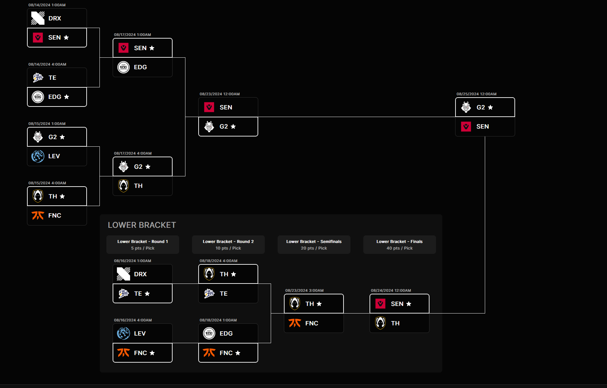
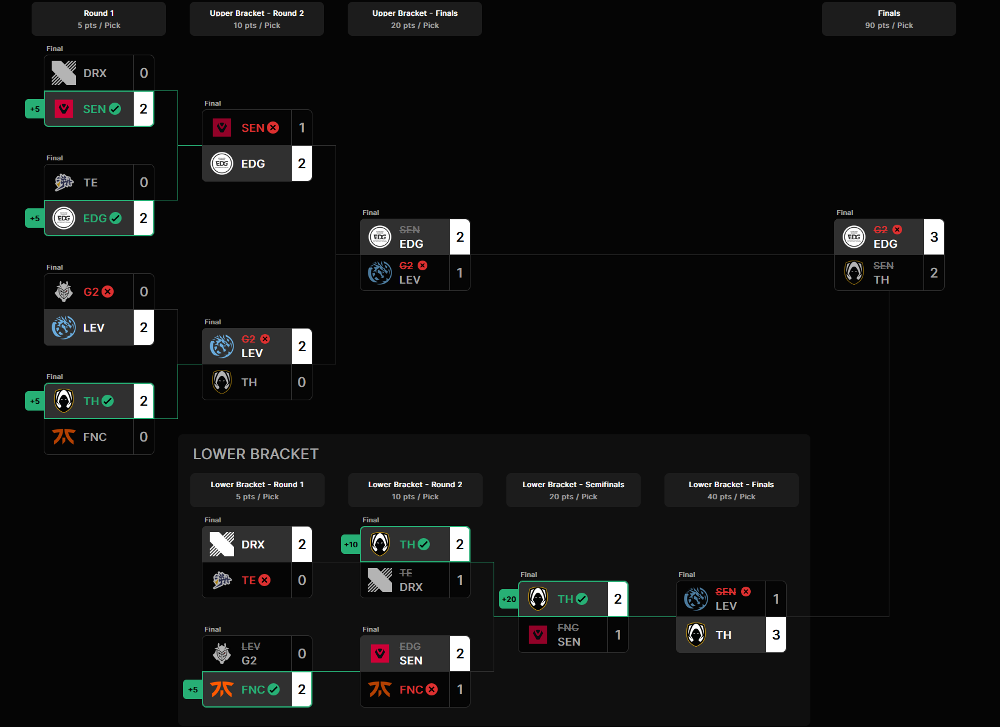

```{r setup, include=FALSE}
library(tidyverse)
library(plm)
library(stargazer)
setwd("../data")
## Notes
# Run order 1, Masters, 2 champs, 3 pred
###########################2021 Season
Masters_Reykjavik_2021 <- read.csv("2021/Masters_Reykjavik2021.csv")
Masters_Berlin_2021 <- read.csv("2021/Masters_Berlin2021.csv")

#Stage 1 Masters Rek
Masters_Reykjavik2021_t <- Masters_Reykjavik_2021 %>%
  separate(Player, into = c("Player_Name", "Team"), sep = "\n", remove = FALSE) %>%
  mutate(Open_Duel_Won = FK / (FK + FD)) %>%
  group_by(Team) %>%
  summarise(across(-c(Player_Name,Player, Agents, CL), list(mean), na.rm = TRUE))

Reykjavik2021_Ranks <- Masters_Reykjavik2021_t %>% ## manually entering team placements from tourny.  ex, If 8-12th, average placement would be 10th
  mutate(rankRey21 = case_when(
    Team %in% c("CR", "SHK") ~ 9.5,
    Team %in% c("KRÜ", "X10") ~ 7.5,
    Team %in% c("V1", "VKS") ~ 5.5,
    Team == "TL" ~ 4,
    Team == "NU" ~ 3,
    Team == "FNC" ~ 2,
    Team == "SEN" ~ 1)) %>% 
  #mutate(GS_win = ifelse(Team %in% c("ACE","TL","GMB","FNC"),1,0)) %>% 
  mutate(ecdf_rank = ecdf(rankRey21)(rankRey21),    ## calc percentile team placed, lower = better placement 
         Percentile = ecdf_rank * 100) %>% 
  rename(CL = CL._1) %>% 
  mutate(Tournament = "Reykjavik 2021")

#Stage 2 Masters Berlin 
Masters_Berlin_2021_t <- Masters_Berlin_2021 %>%
  separate(Player, into = c("Player_Name", "Team"), sep = "\n", remove = FALSE) %>%
  mutate(Open_Duel_Won = FK / (FK + FD)) %>%
  group_by(Team) %>%
  summarise(across(-c(Player_Name,Player, Agents, CL), list(mean), na.rm = TRUE))

Berlin2021_Ranks <- Masters_Berlin_2021_t %>% ## manually entering team placements from tourny. If 8-12th average placenment 10th
  mutate(rankBer21 = case_when(
    Team %in% c("LBR", "ZETA","PRX") ~ 14,
    Team %in% c("F4Q", "CR","KS","SUP") ~ 10.5,
    Team %in% c("ACE", "SEN", "VS","KRÜ") ~ 6.5,
    Team %in% c("100T", "G2") ~ 3.5,
    Team == "NV" ~ 2,
    Team == "GMB" ~ 1)) %>% 
  #mutate(GS_win = ifelse(Team %in% c("ACE","TL","GMB","FNC"),1,0)) %>% 
  mutate(ecdf_rank = ecdf(rankBer21)(rankBer21),    ## calc percentile team placed, lower = better placement 
         Percentile = ecdf_rank * 100) %>% 
  rename(CL = CL._1) %>% 
  mutate(Tournament = "Berlin 2021")
######################################################

########################################## #2022 Season
Masters_Reykjavik_2022 <- read.csv("2022/Masters_Reykjavik2022.csv")
Masters_Copenhagen_2022 <- read.csv("2022/Masters_Copenhagen2022.csv")

#Stage 1 Masters Rek
Masters_Reykjavik2022_t <- Masters_Reykjavik_2022 %>%
  separate(Player, into = c("Player_Name", "Team"), sep = "\n", remove = FALSE) %>%
  mutate(Open_Duel_Won = FK / (FK + FD)) %>%
  group_by(Team) %>%
  summarise(across(-c(Player_Name,Player, Agents, CL), list(mean), na.rm = TRUE))

Reykjavik2022_Ranks <- Masters_Reykjavik2022_t %>% ## manually entering team placements from tourny. If 8-12th average placenment 10th
  mutate(rankRey22 = case_when(
    Team %in% c("KRÜ", "FNC") ~ 11.5,
    Team %in% c("XIA", "NIP") ~ 9.5,
    Team %in% c("TL", "TGRD") ~ 7.5,
    Team %in% c("DRX", "G2") ~ 5.5,
    Team == "PRX" ~ 4,
    Team == "ZETA" ~ 3,
    Team == "LOUD" ~ 2,
    Team == "OPTC" ~ 1)) %>% 
  #mutate(GS_win = ifelse(Team %in% c("ACE","TL","GMB","FNC"),1,0)) %>% 
  mutate(ecdf_rank = ecdf(rankRey22)(rankRey22),    ## calc percentile team placed, lower = better placement 
         Percentile = ecdf_rank * 100) %>% 
  rename(CL = CL._1) %>% 
  mutate(Tournament = "Reykjavik 2022")

#Stage 2 Masters Copenhagen 
Masters_Copenhagen_2022_t <- Masters_Copenhagen_2022 %>%
  separate(Player, into = c("Player_Name", "Team"), sep = "\n", remove = FALSE) %>%
  mutate(Open_Duel_Won = FK / (FK + FD)) %>%
  group_by(Team) %>%
  summarise(across(-c(Player_Name,Player, Agents, CL), list(mean), na.rm = TRUE))

Copenhagen2022_Ranks <- Masters_Copenhagen_2022_t %>% ## manually entering team placements from tourny. If 8-12th average placenment 10th
  mutate(rankCop22 = case_when(
    Team %in% c("XIA", "LOUD") ~ 11.5,
    Team %in% c("NTH", "KRÜ") ~ 9.5,
    Team %in% c("XSET", "GLD") ~ 7.5,
    Team %in% c("DRX", "LEV") ~ 5.5,
    Team == "FNC" ~ 4,
    Team == "OPTC" ~ 3,
    Team == "PRX" ~ 2,
    Team == "FPX" ~ 1)) %>% 
  #mutate(GS_win = ifelse(Team %in% c("ACE","TL","GMB","FNC"),1,0)) %>% 
  mutate(ecdf_rank = ecdf(rankCop22)(rankCop22),    ## calc percentile team placed, lower = better placement 
         Percentile = ecdf_rank * 100) %>% 
  rename(CL = CL._1) %>% 
  mutate(Tournament = "Copenhagen 2022")
##########################################

######################################### 2023 Season
LOCKIN_Sao_Paulo_2023 <- read.csv("2023/LOCKIN_Sao_Paulo2023.csv")
Masters_Tokyo_2023 <- read.csv("2023/Masters_Tokyo2023.csv")

# stage 1 lock in San Paulo
LOCKIN_Sao_Paulo_2023_t <- LOCKIN_Sao_Paulo_2023 %>%
  separate(Player, into = c("Player_Name", "Team"), sep = "\n", remove = FALSE) %>%
  mutate(Open_Duel_Won = FK / (FK + FD)) %>%
  group_by(Team) %>%
  summarise(across(-c(Player_Name,Player, Agents, CL), list(mean), na.rm = TRUE))

Paulo2023_Ranks <- LOCKIN_Sao_Paulo_2023_t %>% ## manually entering team placements from tourny. If 8-12th average placenment 10th
  mutate(rankPau23 = case_when(
    Team %in% c("T1", "SEN","EDG","RRQ","GE","ZETA", "KRÜ","TL","MIBR","TH","PRX", "BBL","FPX","GEN","DFM","KOI") ~ 24.5,
    Team %in% c("FUR", "FUT","VIT","TS","EG","C9", "KC","GIA") ~ 12.5,
    Team %in% c("NRG", "TLN","LEV","100T") ~ 6.5,
    Team %in% c("NAVI", "DRX") ~ 3.5,
    Team == "LOUD" ~ 2,
    Team == "FNC" ~ 1)) %>% 
  #mutate(GS_win = ifelse(Team %in% c("ACE","TL","GMB","FNC"),1,0)) %>% 
  mutate(ecdf_rank = ecdf(rankPau23)(rankPau23),    ## calc percentile team placed, lower = better placement 
         Percentile = ecdf_rank * 100) %>% 
  rename(CL = CL._1) %>% 
  mutate(Tournament = "Sao Paulo 2023")

# stage 2 Tokyo 
Masters_Tokyo_2023_t <- Masters_Tokyo_2023 %>%
  separate(Player, into = c("Player_Name", "Team"), sep = "\n", remove = FALSE) %>%
  mutate(Open_Duel_Won = FK / (FK + FD)) %>%
  group_by(Team) %>%
  summarise(across(-c(Player_Name,Player, Agents, CL), list(mean), na.rm = TRUE))

Tokyo2023_Ranks <- Masters_Tokyo_2023_t %>% ## manually entering team placements from tourny. If 8-12th average placenment 10th
  mutate(rankTok23 = case_when(
    Team %in% c("ASE", "NAVI") ~ 11.5,
    Team %in% c("FUT", "T1") ~ 9.5,
    Team %in% c("DRX", "LOUD") ~ 7.5,
    Team %in% c("EDG", "TL") ~ 5.5,
    Team == "NRG" ~ 4,
    Team == "PRX" ~ 3,
    Team == "EG" ~ 2,
    Team == "FNC" ~ 1)) %>% 
  #mutate(GS_win = ifelse(Team %in% c("ACE","TL","GMB","FNC"),1,0)) %>% 
  mutate(ecdf_rank = ecdf(rankTok23)(rankTok23),    ## calc percentile team placed, lower = better placement 
         Percentile = ecdf_rank * 100) %>% 
  rename(CL = CL._1) %>% 
  mutate(Tournament = "Tokyo 2023")
############################################################

######################################### 2024 Season
Masters_Madrid2024 <- read.csv("2024/Masters_Madrid2024.csv")
Masters_Shanghai2024 <- read.csv("2024/Masters_Shanghai2024.csv")

#Stage 1 Masters Madrid
Masters_Madrid2024_t <- Masters_Madrid2024 %>%
  separate(Player, into = c("Player_Name", "Team"), sep = "\n", remove = FALSE) %>%
  mutate(Team = str_trim(Team)) %>% 
  mutate(Open_Duel_Won = FK / (FK + FD)) %>%
  group_by(Team) %>%
  summarise(across(-c(Player_Name,Player, Agents, CL), list(mean), na.rm = TRUE))

Madrid2024_Ranks <- Masters_Madrid2024_t %>% ## manually entering team placements from tourny. If 8-12th average placenment 10th
  mutate(RankMad24 = case_when(
    Team %in% c("TH", "FPX") ~ 7.5,
    Team %in% c("EDG", "KC") ~ 5.5,
    Team == "LOUD" ~ 4,
    Team == "PRX" ~ 3,
    Team == "GEN" ~ 2,
    Team == "SEN" ~ 1)) %>% 
  mutate(ecdf_rank = ecdf(RankMad24)(RankMad24),    ## calc percentile team placed, lower = better placement 
         Percentile = ecdf_rank * 100) %>% 
  rename(CL = CL._1) %>% 
  mutate(Tournament = "Madrid 2024")

## stage 2 shanghai 

Masters_Shanghai2024_t <- Masters_Shanghai2024 %>%
  separate(Player, into = c("Player_Name", "Team"), sep = "\n", remove = FALSE) %>%
  mutate(Team = str_trim(Team)) %>% 
  mutate(Open_Duel_Won = FK / (FK + FD)) %>%
  group_by(Team) %>%
  summarise(across(-c(Player_Name,Player, Agents, CL), list(mean), na.rm = TRUE))

Shanghai2024_Ranks <- Masters_Shanghai2024_t %>% ## manually entering team placements from tourny. If 8-12th average placenment 10th
  mutate(RankShang24 = case_when(
    Team %in% c("T1", "DRG") ~ 11.5,
    Team %in% c("LEV", "FPX") ~ 9.5,
    Team %in% c("FNC", "EDG") ~ 7.5,
    Team %in% c("FUT", "PRX") ~ 5.5,
    Team == "100T" ~ 4,
    Team == "G2" ~ 3,
    Team == "TH" ~ 2,
    Team == "GEN" ~ 1)) %>% 
  mutate(ecdf_rank = ecdf(RankShang24)(RankShang24),    ## calc percentile team placed, lower = better placement 
         Percentile = ecdf_rank * 100) %>% 
  rename(CL = CL._1) %>% 
  mutate(Tournament = "Shanghai 2024")

###---------------------------------------------------------------------------------------- Championship tournaments

vct_championships_2021 <- read.csv("2021/Valorant_Championships2021_gs.csv")
vct_championships_2022 <- read.csv("2022/Valorant_Championships2022_gs.csv")
vct_championships_2023 <- read.csv("2023/Valorant_Championships2023_gs.csv")

## cleaning data, adding Open DUel won variable in case if needed
Championships_2021 <- vct_championships_2021 %>%
  separate(Player, into = c("Player_Name", "Team"), sep = "\n", remove = FALSE) %>%
  mutate(Open_Duel_Won = FK / (FK + FD)) %>%
  group_by(Team) %>%
  summarise(across(-c(Player_Name,Player, Agents, CL), list(mean), na.rm = TRUE))

Championships_2022 <- vct_championships_2022 %>%
  separate(Player, into = c("Player_Name", "Team"), sep = "\n", remove = FALSE) %>%
  mutate(Open_Duel_Won = FK / (FK + FD)) %>%
  group_by(Team) %>%
  summarise(across(-c(Player_Name,Player, Agents, CL), list(mean), na.rm = TRUE))

Championships_2023 <- vct_championships_2023 %>%
  separate(Player, into = c("Player_Name", "Team"), sep = "\n", remove = FALSE) %>%
  mutate(Open_Duel_Won = FK / (FK + FD)) %>%
  group_by(Team) %>%
  summarise(across(-c(Player_Name,Player, Agents, CL), list(mean), na.rm = TRUE))

######
Champ2021_Ranks <- Championships_2021 %>%
  mutate(rank = case_when(
    Team %in% c("FUR", "FS", "CR", "KS") ~ 14.5,
    Team %in% c("VS", "VKS", "SEN", "NV") ~ 10.5,
    Team %in% c("TS", "C9", "X10", "FNC") ~ 6.5,
    Team %in% c("KRÜ", "TL") ~ 3.5,
    Team == "GMB" ~ 2,
    Team == "ACE" ~ 1)) %>%
  mutate(GS_win = ifelse(Team %in% c("ACE", "TL", "GMB", "FNC"), 1, 0)) %>%
  mutate(ecdf_rank = ecdf(rank)(rank),    ## calc percentile team placed, lower = better placement 
         Percentile = ecdf_rank * 100) %>%
  rename(CL = CL._1) %>%
  mutate(Tournament = "Championships 2021") %>%
  mutate(experience = ifelse(Team %in% Reykjavik2021_Ranks$Team | Team %in% Berlin2021_Ranks$Team, 1, 0)) %>% # Experience var determines if a team has been to any internation event(didn't end up using)
  left_join(Reykjavik2021_Ranks %>% select(Team, Per_rey = Percentile, rankRey21), by = "Team") %>%
  left_join(Berlin2021_Ranks %>% select(Team, Per_ber = Percentile, rankBer21), by = "Team") %>%
  mutate(performance = ifelse(experience == 1 & (Per_rey <= 70 | Per_ber <= 70), 1, 0),
         performance = ifelse(is.na(performance), 0, performance),
         win = ifelse(rankRey21 == 1 | rankBer21 ==1 , 1,0)) %>% 
  replace_na(list(win = 0)) %>%
  select(-Per_rey, -Per_ber)


Champ2022_Ranks <- Championships_2022 %>% ## manually entering team placements from tourny. If 8-12th average placenment 10th
  mutate(rank = case_when(
    Team %in% c("FUR", "XIA", "BME", "EDG") ~ 14.5,
    Team %in% c("100T", "KRÜ", "ZETA", "PRX") ~ 10.5,
    Team %in% c("TL", "LEV") ~ 7.5,
    Team %in% c("XSET", "FNC") ~ 5.5,
    Team == "FPX" ~ 4,
    Team == "DRX" ~ 3,
    Team == "OPTC" ~ 2,
    Team == "LOUD" ~ 1)) %>% 
  mutate(GS_win = ifelse(Team %in% c("LEV","OPTC","XSET","DRX"),1,0)) %>% 
  mutate(ecdf_rank = ecdf(rank)(rank),    ## calc percentile team placed, lower = better placement 
         Percentile = ecdf_rank * 100) %>% 
  rename(CL = CL._1) %>% 
  mutate(Tournament = "Championships 2022") %>% 
  mutate(experience = ifelse(Team %in% Reykjavik2022_Ranks$Team | Team %in% Copenhagen2022_Ranks$Team, 1, 0)) %>%   # Experience var determines if a team has been to any internation event(didn't end up using)
  left_join(Reykjavik2022_Ranks %>% select(Team, Per_rey = Percentile,rankRey22), by = "Team") %>%
  left_join(Copenhagen2022_Ranks %>% select(Team, Per_cop = Percentile,rankCop22), by = "Team") %>%
  mutate(performance = ifelse(experience == 1 & (Per_rey <= 70 | Per_cop <= 70), 1, 0),
         performance = ifelse(is.na(performance), 0, performance),
         win = ifelse(rankRey22 == 1 | rankCop22 ==1 , 1,0)) %>% 
  replace_na(list(win = 0)) %>%
  select(-Per_rey, -Per_cop)


Champ2023_Ranks <- Championships_2023 %>% ## manually entering team placements from tourny. If 8-12th average placenment 10th
  mutate(rank = case_when(
    Team %in% c("ZETA", "TL", "FPX", "KRÜ") ~ 14.5,
    Team %in% c("NAVI", "T1", "GIA", "NRG") ~ 10.5,
    Team %in% c("FUT", "BLG") ~ 7.5,
    Team %in% c("EDG", "DRX") ~ 5.5,
    Team == "FNC" ~ 4,
    Team == "LOUD" ~ 3,
    Team == "PRX" ~ 2,
    Team == "EG" ~ 1)) %>% 
  mutate(GS_win = ifelse(Team %in% c("PRX","EG","FNC","DRX"),1,0)) %>% 
  mutate(ecdf_rank = ecdf(rank)(rank),    ## calc percentile team placed, lower = better placement 
         Percentile = ecdf_rank * 100) %>% 
  rename(CL = CL._1) %>% 
  mutate(Tournament = "Championships 2023") %>% 
  #mutate(experience = ifelse(Team %in% Paulo2023_Ranks$Team | Team %in% Tokyo2023_Ranks$Team, 1, 0)) %>%
  mutate(experience = ifelse(Team %in% Tokyo2023_Ranks$Team, 1, 0)) %>%
  #left_join(Paulo2023_Ranks %>% select(Team, Per_sao = Percentile), by = "Team") %>%
  left_join(Tokyo2023_Ranks %>% select(Team, Per_tok = Percentile,rankTok23), by = "Team") %>%
  #mutate(performance = ifelse(experience == 1 & (Per_sao <= 70 | Per_tok <= 70), 1, 0), ## add if want to add sao paolo     # Decided to not use this tournament since all teams auto qualified for it 
         #performance = ifelse(is.na(performance), 0, performance)) %>% 
  #select(-Per_sao, -Per_tok)
  mutate(performance = ifelse(experience == 1 & (Per_tok <= 70), 1, 0),
         performance = ifelse(is.na(performance), 0, performance),
         win = ifelse(rankTok23 ==1 , 1,0)) %>% 
  replace_na(list(win = 0)) %>%
  select(-Per_tok)

##################################### c

##########
Total_Champs <- bind_rows(Champ2021_Ranks,Champ2022_Ranks,Champ2023_Ranks)

#_--------------------------------------------------------------------------- Prediction/graphs

vct_championships_2024 <- read.csv("2024/Valorant_Championships2024_gs.csv")

## only uses group stage stats for champs 2024
Champs_2024 <- vct_championships_2024 %>%
  separate(Player, into = c("Player_Name", "Team"), sep = "\n", remove = FALSE) %>%
  mutate(Team = str_trim(Team)) %>% 
  mutate(Open_Duel_Won = FK / (FK + FD)) %>%
  group_by(Team) %>%
  summarise(across(-c(Player_Name,Player, Agents, CL), list(mean), na.rm = TRUE)) %>% 
  mutate(GS_win = ifelse(Team %in% c("DRX","TH","TE","G2"),1,0)) %>% 
  mutate(experience = ifelse(Team %in% Madrid2024_Ranks$Team | Team %in% Shanghai2024_Ranks$Team, 1, 0)) %>%
  left_join(Madrid2024_Ranks %>% select(Team, Per_mad = Percentile), by = "Team") %>%
  left_join(Shanghai2024_Ranks %>% select(Team, Per_shang = Percentile), by = "Team") %>%
  mutate(performance = ifelse(experience == 1 & (Per_mad <= 70 | Per_shang <= 70), 1, 0),
         performance = ifelse(is.na(performance), 0, performance)) %>% 
  select(-Per_mad, -Per_shang)


Pred <- Champs_2024 %>% 
  filter(!Team %in% c("FUT", "TLN", "FPX", "BLG", "PRX", "VIT", "GEN", "KRÜ")) %>% ## Removes teams that didn't qualify for playoffs, their placements are already determined
  mutate(prediction = 236.123 + R_1*-165.90 + GS_win*-14.284 + performance*-13.81) %>%  ## calculating expected placement value from regression
  select(Team,prediction) %>% 
  arrange(prediction)

# ggplot(data = Pred, aes(x = reorder(Team, prediction), y = prediction)) + 
#   geom_col() 

pred <- ggplot(data = Pred, aes(x = reorder(Team, prediction), y = prediction, fill = Team)) + 
  geom_col() + labs(title = "Valorant Teams Predicited Placings (Playoffs)",x = "Teams", y = "Predicted Placement") +
  #scale_fill_manual(values = c("G2" = "gold", "SEN" = "grey70", "TH" = "gold4", "FNC" = "sienna4")) +
  theme_bw() +
  annotate("text", x = 1, y = -1, label = "1st", size = 4.5) + 
  annotate("text", x = 2, y = -1, label = "2nd", size = 4.5) +
  annotate("text", x = 3, y = -1, label = "3rd", size = 4.5) +
  annotate("text", x = 4, y = -1, label = "4th", size = 4.5) +
  annotate("text", x = 5, y = -1, label = "5th", size = 4.5) +
  annotate("text", x = 6, y = -1, label = "6th", size = 4.5) +
  annotate("text", x = 7, y = -1, label = "7th", size = 4.5) +
  annotate("text", x = 8, y = -1, label = "8th", size = 4.5) +
  theme(
    plot.title = element_text(size = 12),  # Title font
    axis.title.x = element_text(size = 12),  # X-axis 
    axis.title.y = element_text(size = 12),  # Y-axis 
    axis.text.x = element_text(size = 12),  # X-axis tick labels
    axis.text.y = element_text(size = 12)  # Y-axis tick labels
  )

actual <- ggplot(data = Pred, aes(x = factor(Team, levels = c("EDG","TH","LEV","SEN","DRX","FNC","TE","G2")), y = prediction, fill = Team)) + 
  geom_col() + labs(title = "Valorant Teams Actual Placings (Playoffs)",x = "Teams", y = "Actual Placement") +
  #scale_fill_manual(values = c("G2" = "gold", "SEN" = "grey70", "TH" = "gold4", "FNC" = "sienna4")) +
  theme_bw() +
  annotate("text", x = 1, y = -1, label = "1st", size = 4.5) + 
  annotate("text", x = 2, y = -1, label = "2nd", size = 4.5) +
  annotate("text", x = 3, y = -1, label = "3rd", size = 4.5) +
  annotate("text", x = 4, y = -1, label = "4th", size = 4.5) +
  annotate("text", x = 5, y = -1, label = "5th", size = 4.5) +
  annotate("text", x = 6, y = -1, label = "6th", size = 4.5) +
  annotate("text", x = 7, y = -1, label = "7th", size = 4.5) +
  annotate("text", x = 8, y = -1, label = "8th", size = 4.5) +
    theme(
    plot.title = element_text(size = 12),  # Title font
    axis.title.x = element_text(size = 12),  # X-axis 
    axis.title.y = element_text(size = 12),  # Y-axis 
    axis.text.x = element_text(size = 12),  # X-axis tick labels
    axis.text.y = element_text(size = 12)  # Y-axis tick labels
  )

reg_champs <- Total_Champs %>% 
  rename(Placement = Percentile,
         Rating = R_1,
         Performance = performance)


```

# **Abstract**

     The goal of this project is to determine how well a regression model can perform against the Valorant player base to predict the outcomes of a Valorant videogame tournament. I used data from VLR.gg that records player statistics. I cleaned the data by creating statistics for each team by averaging player statistics. I then created a regression based on the team’s performance metrics. The results show that the regression placed in the top 4th percentile out of several hundred thousand participants predicting the matches.

# **Intro**

     Recently, the videogame Valorant introduced a prediction bracket that allows users to earn points for correct predictions. This created an opportunity to see how well a prediction model can perform against a large group of people who watch and follow a game closely. Valorant is a first-person shooter game by Riot Games. Unlike other games in the shooter genre like Counter Strike or Team Fortress 2, Valorant is updated several times throughout its competitive season. This creates frequent shifts in competitor strategies and play styles making it difficult to predict how teams will perform.

     In order to build the regression model, it’s important to understand the Valorant tournament structure. Each competitive season begins with regional tournaments that qualify teams for international events that occur twice per season. Based on their performance, four teams from each region qualify for the championship tournament which consists of two stages: a group stage, where half the teams advance, and the playoffs. The goal of the regression model is to use data from the group stage to predict playoff results as accurately as possible.

# **Data and Methods**

     Data for these tournaments is sourced from VLR, a platform that tracks player statistics across Valorant tournaments. Tournaments from 2021-2024 were used consisting of five international events and three championship tournaments. I excluded an international tournament from 2023 because of a rule format change. For that very team automatically qualified for that tournam which wouldn’t properly measure the variables used in the regression. The data itself contains all players who competed, what team they are a part of and their individual statistics. I summarized the dataset by team, calculating each of the new team statistics as the average of their individual scores. The teams’ placements are then manually added, and this process is repeated for the other events. I combined the three cleaned championship tournament datasets together and added two new variables. GS_win checks if a team won their group stage and Performance checks if a team placed in the top 70th percentile at any international tournament that year. I converted all the team’s placements into percentiles since tournament formats constantly change with different placing and cutoff numbers for teams.

     After the 2024 group stage is finished, I used my regression model to calculate the predicted placements in the playoffs. The expected placements, calculated from the regression equation, are shown in Figure 2. However, the expected placement does not always match the final placement, as playoff seeding can influence outcomes. Because of this, teams expected placements are compared against their opponents and the team with the lower expected placement advances through the bracket. This process is illustrated in Figure 3.

# **Estimation**

     The regression from the combined championship data set is as follows:

$$
\text{Placement}_{i} = \beta_0\text{Rating}_{i} + \beta_1\text{GS win}_{i} + \beta_2\text{Performance}_{i}
$$

     While the data is panel data, a fixed effect model cannot be used since each instance of the same team isn’t always the same. Rosters constantly go through changes so the team from the championship tournament in 2021 can look completely different in 2022. Because of this, a normal linear regression is used.

     The team’s placement as a percentile is the independent variable. The lower the percentile, the better the expected placing for a team in the playoff bracket. Rating is the averaged team metric from VLR.gg. It calculates how effectively a player performed throughout the tournament. If we see a team with a high Rating value, it can be assumed that it would increase their chances of having a better placing in the tournament since the whole team played well. This trend is also seen with the coefficient value of -165.9 with a standard error of 31.2 which shows a strong statistical significance to lower/better placements. GS_win is a binary variable, and its value is 1 if a team won their group stage in the championship tournament. I believe teams that win their group stage improve their placements because they have a lower seeded matchup in the playoffs. The results match this belief with a coefficient value of -14.3 and a standard error of 7.5 with a close statistical significance. The last variable Performance was added to show that experience matters. Teams that performed well in other international tournaments will be used to high pressure environments. This will help them place better in the playoffs. The Performance variable has a coefficient value of -13.8 and a standard error of 6.5 which shows its statistical significance to helping teams place better.

# **Results**

     Although several matches were correctly predicted, none of the final placements were predicted exactly. The model doesn’t predict the group stage, so I used my own judgment for that phase and placed in the top 20th percentile. After applying the regression model to predict the playoff stage, my score improved, placing me in the top 4th percentile among the hundreds of thousands of participants who were also predicating the tournament outcomes. While the model struggled to predict final placements, it was able to predict a significant number of matches correctly, as seen in Figure 4.

# **Conclusion**

     There are several ways the regression model could be improved to mitigate omitted variable bias. Many factors contribute to a team’s performance beyond recent results and season-long consistency. For instance, a momentum variable could be added—indicating whether a team has won more than 50% of its last 10 games—as momentum can help carry teams deeper into the playoffs. Additionally, a factor variable could be introduced for each region, as some regions may consistently perform better or worse. An interaction variable between GS_win and region could also reveal whether top-seeded teams from certain regions perform better than others in the playoffs. The Rating variable also has a very strong statistical significance and could be absorbing other factors that aren’t accounted for. Rating is used to measure a team’s performance but there are also many other factors that go into performance such as teamwork or prep work before the tournament which the model doesn’t account for. With these new proposed variables added, it could potentially show the effect of Rating more accurately and create an even better prediction model.    

\newpage

# **Figure 1**

```{r stargazer_table, results='asis', echo=FALSE}

pred_reg <- plm(Placement ~ Rating + GS_win + Performance, data = reg_champs, model = "pooling")

stargazer(pred_reg, type = "latex", title = "Valorant Placement Regression")

```

# **Figure 2**

```{r, echo=FALSE,fig.height=5, fig.width=6}
pred
```

# **Figure 2.5**

```{r, echo=FALSE,fig.height=5, fig.width=6}
actual

```

\newpage

# **Figure 3:**

-Playoff bracket predictions by comparing expected placements

```{r echo=FALSE,fig.height=3, fig.width=8}

```

\newpage

# **Figure 4:**

-Playoff results

```{r echo=FALSE,fig.height=3, fig.width=8}


setwd("../output")
write_csv(Total_Champs, "Champs.csv")
```
